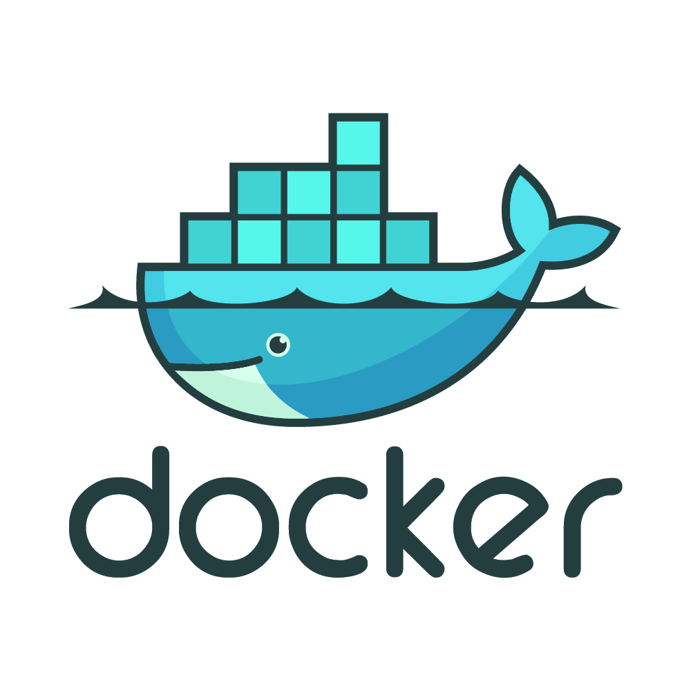

<html lang="en">
  <head>
    <link rel="stylesheet" href="https://github.com/BharathChavala1/BharathChavala1/blob/main/docs/style.css" />
  </head>
  <body>
    

      <h1>Hi there, Welcome to my GitHub 👋</h1>
      <h3>About me:</h3>
      

        I am Bharath Chavala, a dedicated Full Stack Developer with extensive
        experience in both backend and frontend technologies.
         
         Throughout my career, I have honed my skills in various
        technologies, including backend development with Java and frontend
        development with HTML, CSS, JavaScript, and ReactJS. Additionally, I
        have experience in cloud services with AWS, which has allowed me to
        develop robust and scalable applications.   In my professional
        journey, I have been involved in diverse projects, ranging from building
        dynamic user interfaces to creating efficient and secure backend
        systems. My work has consistently focused on leveraging the latest
        technologies to deliver high-quality software solutions that meet client
        requirements. I am passionate about continuously learning and applying
        new skills to solve real-world problems through innovative software
        development. My goal is to contribute to projects that push the
        boundaries of technology, ensuring efficiency, scalability, and an
        exceptional user experience.
      

      <h4>Exploring Opportunities:</h4>
      

        I am currently actively looking for new opportunities to apply my
        expertise and contribute to exciting and challenging projects.
      

    

    

      <h2>Projects:</h2>
      <ul>
        <li>
          <a href="">E-commerce Microservices Architecture:</a>
          - Microservice Architecture, Kafka, Sync Communication, Async
          Communication, Docker, Zipkin, Grafana, Resilience4j.
        </li>
      </ul>
    

    

      <h2>Skills and Technologies:</h2>
    

    

  
  
  
  
  
  
  
  
  
  

  
  
  
  
  
  
  
  
  
 
  

    

      <h2>Contact:</h2>
      <ul>
        <li>
          Email:
          bharath.chavala123@gmail.com
        </li>
        <li><a href="">LinkedIn</a></li>
        <li><a href="">My Portfolio</a></li>
      </ul>
    

  </body>
</html>
